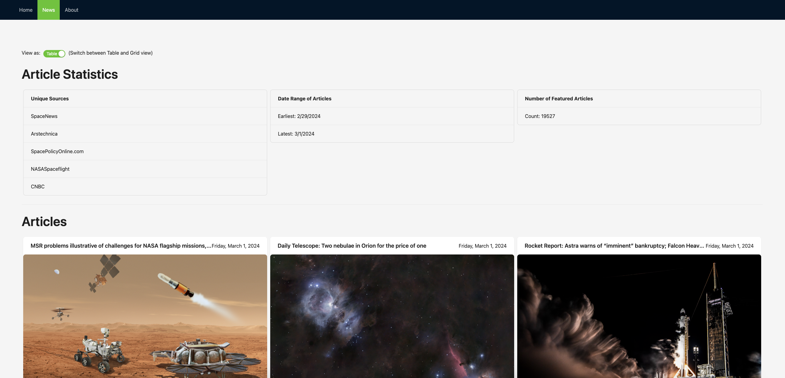
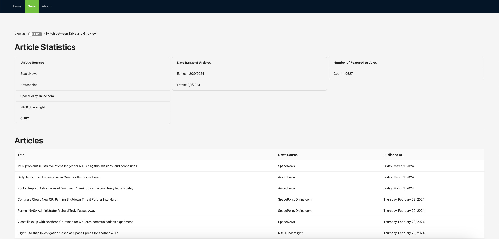

# Space News
A web app created with NextJS and styled with Antd that makes an API call and shows the most recent space news.

## News Page


This is the table view of the articles.  



This is the grid view of the articles.

## Running the App

First, run the development server:

```bash
npm install
npm run dev
```
 
